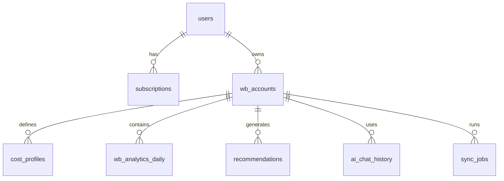

На основе всего собранного функционала — от аналитики Unit-экономики до прогнозов и AI-рекомендаций — вот **полная и продуманная структура базы данных** для твоего проекта **WB Insight**.

Все модели ориентированы на:
- поддержку **многопользовательской подписки**,
- работу с **несколькими WB-кабинетами на одного пользователя**,
- хранение **чувствительных данных (токенов)** безопасно,
- расчёт **реальной прибыли** через ввод **себестоимости и налогов**,
- генерацию **AI-рекомендаций и прогнозов**.

---

## 🧱 1. `users` — Пользователи системы

| Поле | Тип | Описание |
|------|-----|---------|
| `id` | UUID | Уникальный ID пользователя |
| `email` | TEXT (UNIQUE) | Email для входа |
| `hashed_password` | TEXT | Хэш пароля (bcrypt) |
| `created_at` | TIMESTAMPTZ | Дата регистрации |
| `is_active` | BOOLEAN | Активен ли аккаунт |
| `timezone` | TEXT | Часовой пояс (для отчётов, например, "Europe/Moscow") |

> 🔐 **Безопасность**: пароли хранятся только в хэшированном виде.

---

## 🧱 2. `subscriptions` — Подписки

| Поле | Тип | Описание |
|------|-----|---------|
| `id` | UUID | ID подписки |
| `user_id` | UUID (FK → users.id) | Владелец |
| `plan` | TEXT | Тариф: `'free'`, `'pro'`, `'enterprise'` |
| `status` | TEXT | `'active'`, `'expired'`, `'cancelled'` |
| `current_period_start` | TIMESTAMPTZ | Начало текущего периода |
| `current_period_end` | TIMESTAMPTZ | Конец текущего периода |
| `yookassa_payment_id` | TEXT | ID платежа в ЮKassa (для возвратов/аудита) |
| `created_at` | TIMESTAMPTZ | Дата создания |

> 💡 Подписка определяет лимиты: кол-во WB-аккаунтов, частоту обновления, доступ к AI.

---

## 🧱 3. `wb_accounts` — WB-кабинеты (магазины)

| Поле | Тип | Описание |
|------|-----|---------|
| `id` | UUID | ID кабинета в системе |
| `user_id` | UUID (FK → users.id) | Привязан к пользователю |
| `wb_seller_id` | UUID | `sid` из токена WB (идентификатор продавца) |
| `wb_name` | TEXT | Название магазина (например, "ИП Кружинин В. Р.") |
| `wb_token_encrypted` | BYTEA | Зашифрованный токен WB (AES-256-GCM или Fernet) |
| `token_categories_mask` | INT | Битовая маска `s` из токена (для проверки прав) |
| `is_readonly` | BOOLEAN | Флаг "только чтение" (бит 30) |
| `created_at` | TIMESTAMPTZ | Дата подключения |
| `last_sync_at` | TIMESTAMPTZ | Последняя синхронизация с WB API |

> 🔒 **Критически важно**: токен **никогда не хранится в открытом виде**.

---

## 🧱 4. `cost_profiles` — Профили себестоимости и налогов

| Поле | Тип | Описание |
|------|-----|---------|
| `id` | UUID | ID профиля |
| `wb_account_id` | UUID (FK → wb_accounts.id) | К какому кабинету относится |
| `nm_id` | BIGINT | Артикул WB (может быть NULL — тогда профиль по умолчанию) |
| `cost_price` | NUMERIC(12,2) | Себестоимость одной единицы (в рублях) |
| `tax_rate` | NUMERIC(5,2) | Налоговая ставка в % (например, 6.00) |
| `external_ad_cost` | NUMERIC(12,2) | Внешние рекламные расходы (опционально) |
| `valid_from` | DATE | С какой даты действует (для историчности) |
| `created_at` | TIMESTAMPTZ | Дата создания записи |

> 💡 Позволяет задавать **разную себестоимость по артикулам и периодам**.

---

## 🧱 5. `wb_analytics_daily` — Ежедневная аналитика по артикулам

| Поле | Тип | Описание |
|------|-----|---------|
| `id` | UUID | ID записи |
| `wb_account_id` | UUID (FK → wb_accounts.id) | Кабинет |
| `date` | DATE | Дата (например, '2025-10-28') |
| `nm_id` | BIGINT | Артикул WB |
| `name` | TEXT | Название товара (кэшируется) |
| `views` | INT | Просмотры |
| `clicks` | INT | Клики |
| `cart_adds` | INT | Добавления в корзину |
| `orders` | INT | Заказы |
| `delivered` | INT | Выкуплено |
| `returns` | INT | Возвраты |
| `revenue` | NUMERIC(14,2) | Выручка (руб) |
| `commission` | NUMERIC(12,2) | Комиссия WB |
| `logistics` | NUMERIC(12,2) | Логистика |
| `storage` | NUMERIC(12,2) | Хранение |
| `penalties` | NUMERIC(12,2) | Штрафы |
| `ad_cost` | NUMERIC(12,2) | Расходы на WB.Продвижение |
| `stocks` | INT | Остатки на конец дня |
| `updated_at` | TIMESTAMPTZ | Время обновления записи |

> 📊 Основа для всех расчётов: маржинальность, прибыль, ROAS, CTR.

---

## 🧱 6. `product_metrics` — Расчётные метрики (виртуальная или материализованная)

> Можно считать на лету или кэшировать в фоне.

| Поле | Тип | Формула / Описание |
|------|-----|-------------------|
| `profit` | NUMERIC(14,2) | `revenue - commission - logistics - storage - penalties - ad_cost - cost_price * delivered - tax` |
| `margin_pct` | NUMERIC(5,2) | `(profit / revenue) * 100` |
| `roas` | NUMERIC(6,2) | `revenue / NULLIF(ad_cost, 0)` |
| `ctr` | NUMERIC(5,2) | `(clicks::FLOAT / NULLIF(views, 0)) * 100` |
| `conversion_rate` | NUMERIC(5,2) | `(delivered::FLOAT / NULLIF(orders, 0)) * 100` |

> 💡 Эти поля **не хранятся в БД**, а вычисляются в FastAPI на основе `wb_analytics_daily` + `cost_profiles`.

---

## 🧱 7. `recommendations` — Рекомендации ИИ

| Поле | Тип | Описание |
|------|-----|---------|
| `id` | UUID | ID рекомендации |
| `wb_account_id` | UUID (FK → wb_accounts.id) | Для какого кабинета |
| `nm_id` | BIGINT | Артикул (может быть NULL — общая рекомендация) |
| `type` | TEXT | Тип: `'low_stock'`, `'low_roas'`, `'high_margin'`, `'seasonal_opportunity'`, `'poor_ctr'` |
| `message` | TEXT | Текст рекомендации для пользователя |
| `severity` | TEXT | `'info'`, `'warning'`, `'critical'` |
| `forecast_impact` | NUMERIC(14,2) | Ожидаемый прирост прибыли (в рублях) |
| `is_read` | BOOLEAN | Прочитана ли |
| `generated_at` | TIMESTAMPTZ | Когда сгенерирована |
| `expires_at` | TIMESTAMPTZ | Когда перестаёт быть актуальной |

> 🤖 Генерируется фоновой задачей на основе анализа `wb_analytics_daily`.

---

## 🧱 8. `ai_chat_history` — История диалогов с AI-аналитиком

| Поле | Тип | Описание |
|------|-----|---------|
| `id` | UUID | ID сообщения |
| `user_id` | UUID (FK → users.id) | Пользователь |
| `wb_account_id` | UUID (FK → wb_accounts.id) | Контекст кабинета |
| `query` | TEXT | Вопрос пользователя |
| `answer` | TEXT | Ответ ИИ |
| `sources` | JSONB | Источники: `{"type": "ad_stats", "period": "2025-10-20/2025-10-27"}` |
| `created_at` | TIMESTAMPTZ | Время запроса |

> 💬 Позволяет строить контекст и улучшать ИИ со временем.

---

## 🧱 9. `sync_jobs` — Задачи синхронизации с WB API

| Поле | Тип | Описание |
|------|-----|---------|
| `id` | UUID | ID задачи |
| `wb_account_id` | UUID (FK → wb_accounts.id) | Кабинет |
| `status` | TEXT | `'pending'`, `'running'`, `'success'`, `'failed'` |
| `started_at` | TIMESTAMPTZ | Начало |
| `finished_at` | TIMESTAMPTZ | Окончание |
| `error_message` | TEXT | Ошибка (если есть) |
| `data_fetched` | JSONB | Краткий лог: какие эндпоинты обновлены |

> ⏳ Позволяет отслеживать статус фоновых обновлений.

---

## 🔗 Связи между таблицами

---

## 💡 Важные замечания

1. **Индексация**:  
   - Обязательно индексы по `(wb_account_id, date)` в `wb_analytics_daily`  
   - Индекс по `(user_id, created_at)` в `ai_chat_history`

2. **Шифрование**:  
   - `wb_token_encrypted` шифруется с помощью ключа из `.env` (не в коде!)  
   - Никогда не логировать токены

3. **Историчность**:  
   - `cost_profiles.valid_from` позволяет менять себестоимость со временем  
   - `wb_analytics_daily` — immutable (только INSERT, не UPDATE)

4. **Производительность**:  
   - Для тяжёлых расчётов (ABC-анализ, прогнозы) — использовать фоновые задачи  
   - Кэшировать агрегаты (например, дашборд за неделю) в Redis

---
