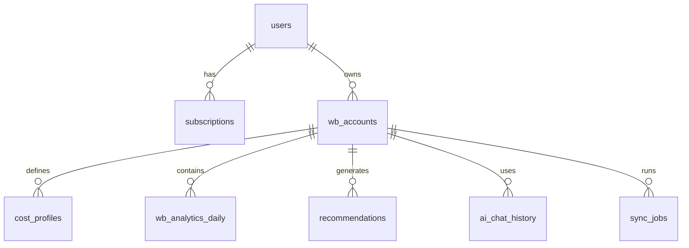
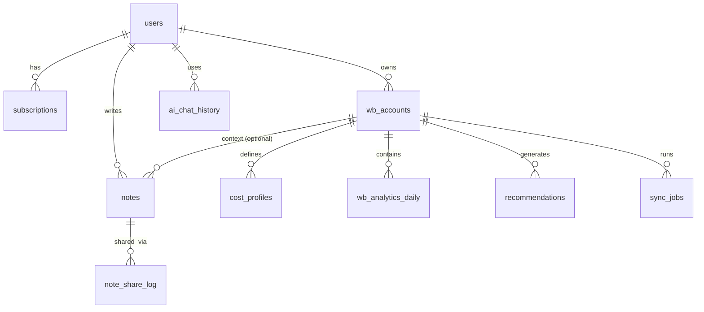

На основе всего собранного функционала — от аналитики Unit-экономики до прогнозов и AI-рекомендаций — вот **полная и продуманная структура базы данных** для твоего проекта **WB Insight**.

Все модели ориентированы на:
- поддержку **многопользовательской подписки**,
- работу с **несколькими WB-кабинетами на одного пользователя**,
- хранение **чувствительных данных (токенов)** безопасно,
- расчёт **реальной прибыли** через ввод **себестоимости и налогов**,
- генерацию **AI-рекомендаций и прогнозов**.

---

## 🧱 1. `users` — Пользователи системы

| Поле | Тип | Описание |
|------|-----|---------|
| `id` | UUID | Уникальный ID пользователя |
| `email` | TEXT (UNIQUE) | Email для входа |
| `phone` | TEXT | Номер телефона (для 2FA и уведомлений) |
| `hashed_password` | TEXT | Хэш пароля (bcrypt) |
| `full_name` | TEXT | ФИО (для физлиц) / Название компании (для юрлиц) |
| `entity_type` | TEXT | `'individual'`, `'self_employed'`, `'legal_entity'` |
| `inn` | TEXT | ИНН (опционально для физлиц, обязательно для юрлиц) |
| `kpp` | TEXT | КПП (только для юрлиц, nullable) |
| `legal_address` | TEXT | Юридический адрес (юрлица) |
| `timezone` | TEXT | Часовой пояс (например, `"Europe/Moscow"`) |
| `created_at` | TIMESTAMPTZ | Дата регистрации |
| `is_active` | BOOLEAN | Активен ли аккаунт |

> 💡 Поле `entity_type` позволяет гибко формировать отчёты и налоговые расчёты.
> 🔐 **Безопасность**: пароли хранятся только в хэшированном виде.

---

## 🧱 2. `tariff_plans` — Тарифные планы (настраиваемые!)

| Поле | Тип | Описание |
|------|-----|---------|
| `id` | TEXT (PRIMARY KEY) | Слаг: `'demo'`, `'starter'`, `'pro'`, `'enterprise'` |
| `name` | TEXT | Отображаемое название: *"Демо"*, *"Старт (для ИП)"*, *"Про"*, *"Бизнес"* |
| `description` | TEXT | Описание для лендинга: *"7 дней бесплатно, без карты"* |
| `price_rub` | NUMERIC(10,2) | Цена в рублях за **месяц** (`0.00` для демо) |
| `is_active` | BOOLEAN | Активен ли тариф (можно скрыть без удаления) |
| `created_at` | TIMESTAMPTZ | Когда создан |
| `updated_at` | TIMESTAMPTZ | Последнее изменение цены/лимитов |

> ✅ Теперь **менять цены можно через админку или SQL-запрос**, а не релизом.

---

## 🧱 3. `tariff_limits` — Лимиты по тарифу

| Поле | Тип | Описание |
|------|-----|---------|
| `tariff_id` | TEXT (FK → tariff_plans.id) | К какому тарифу относится |
| `limit_type` | TEXT | Тип: `'wb_accounts'`, `'nm_ids'`, `'sync_frequency_hours'`, `'ai_queries_per_month'`, `'retention_days'` |
| `limit_value` | INT | Значение: `1`, `5000`, `24`, `100`, `30` |

Примеры записей:
```sql
('starter', 'wb_accounts', 1),
('starter', 'nm_ids', 500),
('starter', 'sync_frequency_hours', 24),
('starter', 'ai_queries_per_month', 20),
('starter', 'retention_days', 30),

('enterprise', 'wb_accounts', 10),
('enterprise', 'nm_ids', 100000),
('enterprise', 'sync_frequency_hours', 1),
('enterprise', 'ai_queries_per_month', 5000),
('enterprise', 'retention_days', 730)
```

> 💡 Такой подход позволяет:
> - легко добавлять новые лимиты (например, `push_notifications_per_day`);
> - задавать разные условия для B2B и B2C;
> - делать A/B-тесты тарифов.

---

## 🧱 4. `subscriptions` — Подписки (обновлённая версия)

| Поле | Тип | Описание |
|------|-----|---------|
| `id` | UUID | ID подписки |
| `user_id` | UUID (FK → users.id) | Владелец |
| `tariff_id` | TEXT (FK → tariff_plans.id) | Текущий тариф |
| `status` | TEXT | `'active'`, `'expired'`, `'cancelled'`, `'demo'` |
| `current_period_start` | TIMESTAMPTZ | Начало периода |
| `current_period_end` | TIMESTAMPTZ | Конец периода |
| `yookassa_payment_id` | TEXT | ID в ЮKassa (nullable для демо) |
| `created_at` | TIMESTAMPTZ | Дата оформления |
| `updated_at` | TIMESTAMPTZ | Последнее изменение |

> 💡 Статус `'demo'` — особый: не требует оплаты, автоматически переходит в `'expired'` через N дней.

---

## 🧱 5. `demo_access_requests` — Заявки на демо-доступ (опционально)

| Поле | Тип | Описание |
|------|-----|---------|
| `id` | UUID |
| `user_id` | UUID (FK → users.id) |
| `requested_at` | TIMESTAMPTZ |
| `approved_at` | TIMESTAMPTZ | Когда активирован демо-доступ |
| `expires_at` | TIMESTAMPTZ | Автоматическое окончание (например, +7 дней) |
| `source` | TEXT | Откуда пришёл: `'landing'`, `'telegram_bot'`, `'referral'` |

> 📊 Позволяет анализировать конверсию из демо → платный тариф.

---

## 🔄 Как это работает на практике

1. Админ создаёт тарифы:
   ```sql
   INSERT INTO tariff_plans (id, name, price_rub, is_active)
   VALUES ('starter', 'Старт (для ИП)', 2990.00, true);
   
   INSERT INTO tariff_limits (tariff_id, limit_type, limit_value)
   VALUES 
     ('starter', 'wb_accounts', 1),
     ('starter', 'nm_ids', 1000),
     ('starter', 'sync_frequency_hours', 6);
   ```

2. При регистрации пользователь выбирает тариф `'starter'`.

3. При расчёте аналитики FastAPI проверяет:
   - `sync_jobs` запускаются не чаще, чем раз в `sync_frequency_hours`;
   - `wb_analytics_daily` хранится не дольше `retention_days`;
   - Запросы к ИИ считают лимит `ai_queries_per_month`.

4. Можно **повысить/понизить тариф** без потери данных — только `tariff_id` меняется.

---

## 📋 Предлагаемые тарифы (по умолчанию)

| Тариф | Цена | Для кого | Ключевые лимиты |
|-------|------|---------|----------------|
| **`demo`** | 0 ₽ | Все новые пользователи | 3 дня, 1 магазин, 100 артикулов, 5 ИИ-запросов |
| **`starter`** | 2 990 ₽/мес | ИП, самозанятые | 1 магазин, 1 000 артикулов, обновление 4×/день |
| **`pro`** | 6 990 ₽/мес | Малый бизнес | 3 магазина, 10 000 артикулов, обновление ежечасно, 200 ИИ-запросов |
| **`business`** | По запросу | Юрлица, маркетплейс-агентства | Безлимит магазинов, API-доступ, персональный менеджер |

> 💡 Цены можно менять без деплоя — просто `UPDATE tariff_plans SET price_rub = 3490 WHERE id = 'starter'`.

---

## 🧩 Дополнительно: поддержка юрлиц в отчётах

- При генерации PDF-отчёта — подставлять:
  - `full_name` → название компании
  - `inn`/`kpp` → в шапку документа
  - `legal_address` → в реквизиты
- В расчёте налога — использовать `entity_type`:
  - `'self_employed'` → 4–6% (ПСН/УСН)
  - `'legal_entity'` → 6% или 15% (УСН), 20% (ОСНО)

---

## 🧱 6. `wb_accounts` — WB-кабинеты (магазины)

| Поле | Тип | Описание |
|------|-----|---------|
| `id` | UUID | ID кабинета в системе |
| `user_id` | UUID (FK → users.id) | Привязан к пользователю |
| `wb_seller_id` | UUID | `sid` из токена WB (идентификатор продавца) |
| `wb_name` | TEXT | Название магазина (например, "ИП Кружинин В. Р.") |
| `wb_token_encrypted` | BYTEA | Зашифрованный токен WB (AES-256-GCM или Fernet) |
| `token_categories_mask` | INT | Битовая маска `s` из токена (для проверки прав) |
| `is_readonly` | BOOLEAN | Флаг "только чтение" (бит 30) |
| `created_at` | TIMESTAMPTZ | Дата подключения |
| `last_sync_at` | TIMESTAMPTZ | Последняя синхронизация с WB API |

> 🔒 **Критически важно**: токен **никогда не хранится в открытом виде**.

---

## 🧱 7. `cost_profiles` — Профили себестоимости и налогов

| Поле | Тип | Описание |
|------|-----|---------|
| `id` | UUID | ID профиля |
| `wb_account_id` | UUID (FK → wb_accounts.id) | К какому кабинету относится |
| `nm_id` | BIGINT | Артикул WB (может быть NULL — тогда профиль по умолчанию) |
| `cost_price` | NUMERIC(12,2) | Себестоимость одной единицы (в рублях) |
| `tax_rate` | NUMERIC(5,2) | Налоговая ставка в % (например, 6.00) |
| `external_ad_cost` | NUMERIC(12,2) | Внешние рекламные расходы (опционально) |
| `valid_from` | DATE | С какой даты действует (для историчности) |
| `created_at` | TIMESTAMPTZ | Дата создания записи |

> 💡 Позволяет задавать **разную себестоимость по артикулам и периодам**.

---

## 🧱 8. `wb_analytics_daily` — Ежедневная аналитика по артикулам

| Поле | Тип | Описание |
|------|-----|---------|
| `id` | UUID | ID записи |
| `wb_account_id` | UUID (FK → wb_accounts.id) | Кабинет |
| `date` | DATE | Дата (например, '2025-10-28') |
| `nm_id` | BIGINT | Артикул WB |
| `name` | TEXT | Название товара (кэшируется) |
| `views` | INT | Просмотры |
| `clicks` | INT | Клики |
| `cart_adds` | INT | Добавления в корзину |
| `orders` | INT | Заказы |
| `delivered` | INT | Выкуплено |
| `returns` | INT | Возвраты |
| `revenue` | NUMERIC(14,2) | Выручка (руб) |
| `commission` | NUMERIC(12,2) | Комиссия WB |
| `logistics` | NUMERIC(12,2) | Логистика |
| `storage` | NUMERIC(12,2) | Хранение |
| `penalties` | NUMERIC(12,2) | Штрафы |
| `ad_cost` | NUMERIC(12,2) | Расходы на WB.Продвижение |
| `stocks` | INT | Остатки на конец дня |
| `updated_at` | TIMESTAMPTZ | Время обновления записи |

> 📊 Основа для всех расчётов: маржинальность, прибыль, ROAS, CTR.

---

## 🧱 9. `product_metrics` — Расчётные метрики (виртуальная или материализованная)

> Можно считать на лету или кэшировать в фоне.

| Поле | Тип | Формула / Описание |
|------|-----|-------------------|
| `profit` | NUMERIC(14,2) | `revenue - commission - logistics - storage - penalties - ad_cost - cost_price * delivered - tax` |
| `margin_pct` | NUMERIC(5,2) | `(profit / revenue) * 100` |
| `roas` | NUMERIC(6,2) | `revenue / NULLIF(ad_cost, 0)` |
| `ctr` | NUMERIC(5,2) | `(clicks::FLOAT / NULLIF(views, 0)) * 100` |
| `conversion_rate` | NUMERIC(5,2) | `(delivered::FLOAT / NULLIF(orders, 0)) * 100` |

> 💡 Эти поля **не хранятся в БД**, а вычисляются в FastAPI на основе `wb_analytics_daily` + `cost_profiles`.

---

## 🧱 10. `recommendations` — Рекомендации ИИ

| Поле | Тип | Описание |
|------|-----|---------|
| `id` | UUID | ID рекомендации |
| `wb_account_id` | UUID (FK → wb_accounts.id) | Для какого кабинета |
| `nm_id` | BIGINT | Артикул (может быть NULL — общая рекомендация) |
| `type` | TEXT | Тип: `'low_stock'`, `'low_roas'`, `'high_margin'`, `'seasonal_opportunity'`, `'poor_ctr'` |
| `message` | TEXT | Текст рекомендации для пользователя |
| `severity` | TEXT | `'info'`, `'warning'`, `'critical'` |
| `forecast_impact` | NUMERIC(14,2) | Ожидаемый прирост прибыли (в рублях) |
| `is_read` | BOOLEAN | Прочитана ли |
| `generated_at` | TIMESTAMPTZ | Когда сгенерирована |
| `expires_at` | TIMESTAMPTZ | Когда перестаёт быть актуальной |

> 🤖 Генерируется фоновой задачей на основе анализа `wb_analytics_daily`.

---

## 🧱 11. `ai_chat_history` — История диалогов с AI-аналитиком

| Поле | Тип | Описание |
|------|-----|---------|
| `id` | UUID | ID сообщения |
| `user_id` | UUID (FK → users.id) | Пользователь |
| `wb_account_id` | UUID (FK → wb_accounts.id) | Контекст кабинета |
| `query` | TEXT | Вопрос пользователя |
| `answer` | TEXT | Ответ ИИ |
| `sources` | JSONB | Источники: `{"type": "ad_stats", "period": "2025-10-20/2025-10-27"}` |
| `created_at` | TIMESTAMPTZ | Время запроса |

> 💬 Позволяет строить контекст и улучшать ИИ со временем.

---

## 🧱 12. `sync_jobs` — Задачи синхронизации с WB API

| Поле | Тип | Описание |
|------|-----|---------|
| `id` | UUID | ID задачи |
| `wb_account_id` | UUID (FK → wb_accounts.id) | Кабинет |
| `status` | TEXT | `'pending'`, `'running'`, `'success'`, `'failed'` |
| `started_at` | TIMESTAMPTZ | Начало |
| `finished_at` | TIMESTAMPTZ | Окончание |
| `error_message` | TEXT | Ошибка (если есть) |
| `data_fetched` | JSONB | Краткий лог: какие эндпоинты обновлены |

> ⏳ Позволяет отслеживать статус фоновых обновлений.

---

## 🔗 Связи между таблицами



---

## 💡 Важные замечания

1. **Индексация**:  
   - Обязательно индексы по `(wb_account_id, date)` в `wb_analytics_daily`  
   - Индекс по `(user_id, created_at)` в `ai_chat_history`

2. **Шифрование**:  
   - `wb_token_encrypted` шифруется с помощью ключа из `.env` (не в коде!)  
   - Никогда не логировать токены

3. **Историчность**:  
   - `cost_profiles.valid_from` позволяет менять себестоимость со временем  
   - `wb_analytics_daily` — immutable (только INSERT, не UPDATE)

4. **Производительность**:  
   - Для тяжёлых расчётов (ABC-анализ, прогнозы) — использовать фоновые задачи  
   - Кэшировать агрегаты (например, дашборд за неделю) в Redis

---

## 🧱 13. `notes` — Личные заметки пользователей (модуль Notes)

| Поле | Тип | Описание |
|------|-----|---------|
| `id` | UUID | Уникальный ID заметки |
| `user_id` | UUID (FK → users.id) | Владелец заметки |
| `title` | VARCHAR(500) | Заголовок заметки (nullable) |
| `content_encrypted` | BYTEA | **Зашифрованный** текст заметки (AES-256-GCM) |
| `content_type` | VARCHAR(20) | Тип контента: `text`, `voice`, `mixed` |
| `media_attachments` | JSONB | Массив медиа-вложений: `[{"type": "image\|audio\|video", "url": "...", "size": bytes, "duration": sec}]` |
| `voice_messages` | JSONB | Массив голосовых сообщений: `[{"url": "...", "duration": sec, "transcript": "...", "created_at": "..."}]` |
| `tags` | VARCHAR[] | Массив тегов для быстрого поиска |
| `is_favorite` | BOOLEAN | Избранное |
| `is_shared` | BOOLEAN | Флаг "поделиться через мессенджер" |
| `share_link_token` | VARCHAR(100) | Уникальный токен для общей ссылки |
| `share_expires_at` | TIMESTAMPTZ | Срок действия ссылки |
| `wb_account_id` | UUID (FK → wb_accounts.id) | Привязка к WB-кабинету (опционально) |
| `nm_id` | BIGINT | Привязка к артикулу WB (опционально) |
| `created_at` | TIMESTAMPTZ | Дата создания |
| `updated_at` | TIMESTAMPTZ | Дата обновления |

> 💡 **Возможности модуля Notes**:
> - **Текст**: шифрование перед сохранением
> - **Медиа**: изображения, видео, аудиофайлы (хранятся в S3)
> - **Голосовые**: запись + автоматическая транскрибация
> - **Шеринг**: отправка ссылок через Telegram, WhatsApp, email
> - **Контекст WB**: привязка заметок к товарам (артикулам)

Пример JSONB для `media_attachments`:
```json
[
  {
    "type": "image",
    "url": "https://storage.wbinsight.com/notes/user-id/note-id/image-1.jpg",
    "size": 245678,
    "mime_type": "image/jpeg",
    "uploaded_at": "2025-01-15T10:30:00Z"
  },
  {
    "type": "audio",
    "url": "https://storage.wbinsight.com/notes/user-id/note-id/voice-1.ogg",
    "size": 123456,
    "duration": 45.5,
    "mime_type": "audio/ogg",
    "uploaded_at": "2025-01-15T10:31:00Z"
  }
]
```

---

## 🧱 14. `note_share_log` — История операций шеринга заметок

| Поле | Тип | Описание |
|------|-----|---------|
| `id` | UUID | Уникальный ID записи |
| `note_id` | UUID (FK → notes.id) | Заметка |
| `shared_via` | VARCHAR(50) | Канал: `telegram`, `whatsapp`, `email`, `link` |
| `recipient_identifier` | VARCHAR(255) | ID получателя или email/phone |
| `shared_at` | TIMESTAMPTZ | Когда поделились |
| `accessed_at` | TIMESTAMPTZ | Когда получили доступ |
| `access_count` | INT | Количество переходов по ссылке |

> 📊 Позволяет отслеживать популярность заметок и аудиторию.

---

## 🔗 Обновлённая схема связей



---
